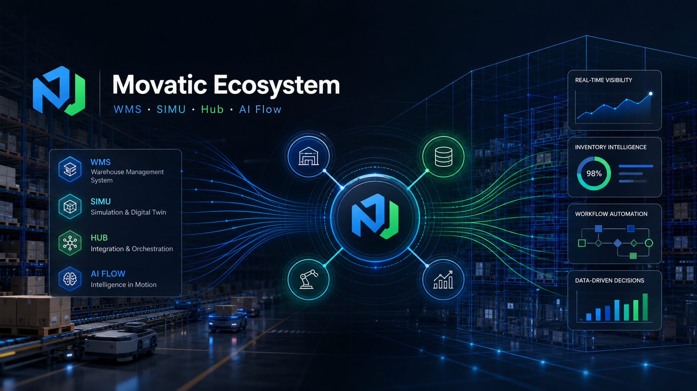

  

# Cesar Tidei

Founder and builder of the **Movatic Ecosystem** — enterprise software for warehouse operations, digital twins, integration, automation and AI-assisted workflows.

I design systems that connect operational reality with simulation, intelligence and execution.

---

## Movatic Ecosystem

| Product | Purpose |
|---|---|
| **Movatic WMS** | Warehouse management, inventory, operators, tasks and operational execution |
| **MovaticSIMU** | 3D simulation, digital twin, layout validation and virtual training |
| **Movatic Hub** | Integration middleware for WMS, ERP, SIMU, MFC, Yard, TMS and AI Flow |
| **Movatic AI Flow** | AI-assisted workflow orchestration and operational intelligence |
| **Memória.Viva** | Knowledge, memory and relationship intelligence |
| **RationalCloud** | Software house operations, client portal and ecosystem foundation |

---

## SOTA Workbench

Current focus areas:

- Warehouse Management Systems
- Digital twins for logistics operations
- 3D simulation with Unreal Engine
- ERP/WMS/MFC/Yard integration
- Middleware architecture
- AI-assisted enterprise workflows
- Operational analytics and process intelligence

---

## Stack

---

## Product Cards

### Movatic WMS
Professional warehouse management for stock, execution, operators, processes and operational control.

### MovaticSIMU
A professional 3D simulation and digital twin platform for warehouse validation, training and what-if analysis.

### Movatic Hub
A canonical integration layer connecting WMS, ERP, SIMU, MFC, Yard, TMS and AI systems through secure adapters.

### Movatic AI Flow
AI-assisted workflows, agents and operational intelligence for business processes.

---

## Engineering Philosophy

Professional software should be:

- useful in real operations;
- auditable by design;
- scalable without losing clarity;
- visually trustworthy;
- simple enough to operate;
- powerful enough to evolve.

> Build systems that make complex operations easier to understand, simulate and improve.
